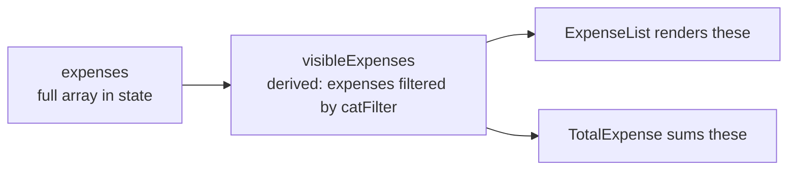

# Why We Pass `expenses={visibleExpenses}` Instead of `expenses={expenses}`

This note explains why, after adding the category filter, the props passed to `ExpenseList` and `TotalExpense` changed from the full `expenses` array to the derived `visibleExpenses` array.

## The prop is a parameter name — the value is what you pass in

Think of it like a function call:

```ts
function greet(name: string) { console.log(name); }

greet("Alice");     // parameter name = "name", value passed = "Alice"
greet("Bob");       // parameter name = "name", value passed = "Bob"
```

Same function, same parameter name, different values. Neither `ExpenseList` nor `TotalExpense` cares *where* the array came from — they just render whatever list they're handed.

Same idea with the components:

```tsx
// Before the filter existed:
<ExpenseList expenses={expenses} />          // pass the full array

// After adding the filter:
<ExpenseList expenses={visibleExpenses} />   // pass the filtered array
```

The prop name (`expenses`) is the child's parameter. The value in the braces is the argument.

## Why swap `expenses` for `visibleExpenses`

`ExpenseList` renders whatever array you give it. If you kept passing `expenses` (the full array), the list would ignore the dropdown entirely — you'd see all items regardless of the filter.

By passing `visibleExpenses`, you're saying: **"Render *this* subset."**



## Two different roles: source of truth vs. display data

This is the key mental split:

| Variable | Role | Used for |
|---|---|---|
| `expenses` | **Source of truth** — what the user has actually added | `addExpense`, `deleteExpense` (mutations) |
| `visibleExpenses` | **Derived view** — what should appear on screen right now | Rendering (`ExpenseList`, `TotalExpense`) |

Notice `addExpense` and `deleteExpense` still operate on `expenses` (via `setExpenses`). You never mutate `visibleExpenses` — it's regenerated on every render from `expenses` + `catFilter`. That's why the filter is *non-destructive*: switching from "Food" back to "All" instantly shows everything again, because the underlying `expenses` array was never touched.

## What would break if you passed `expenses` instead

- **List**: filter dropdown has no effect — you'd see every item always.
- **Total**: total would always be the grand total, not the filtered total (which was the whole point of lifting the filter state to `App`).

## Could you rename the prop for clarity?

You could, if you wanted the child to make it explicit that it's receiving pre-filtered data:

```tsx
<ExpenseList items={visibleExpenses} />
```

But there's no need. From `ExpenseList`'s point of view, it's just "the expenses I should display." The child doesn't need to know the parent filtered them first — and that's actually a good thing. It keeps the child reusable: you could later pass sorted expenses, searched expenses, or paginated expenses, and `ExpenseList` wouldn't need any changes.

## The general principle

**Children should be dumb about where their data comes from.** Parents assemble/filter/sort data and hand a final array down. Children just render what they receive. This is one of React's core patterns and it's why swapping `expenses` for `visibleExpenses` was a one-line change with no updates needed inside `ExpenseList` or `TotalExpense`.
