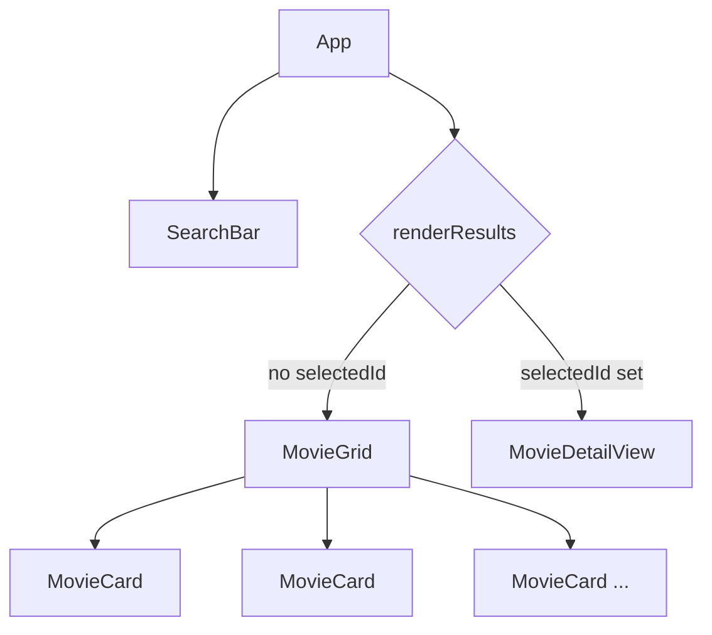
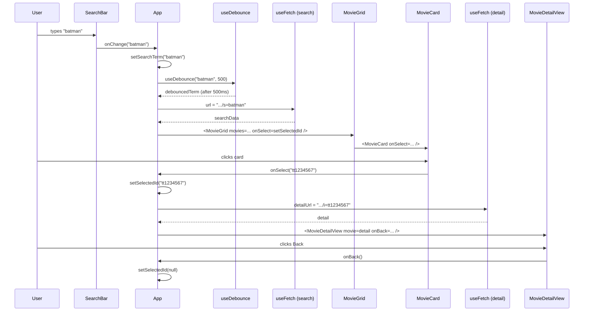
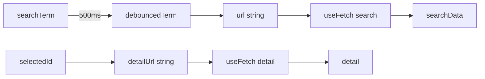
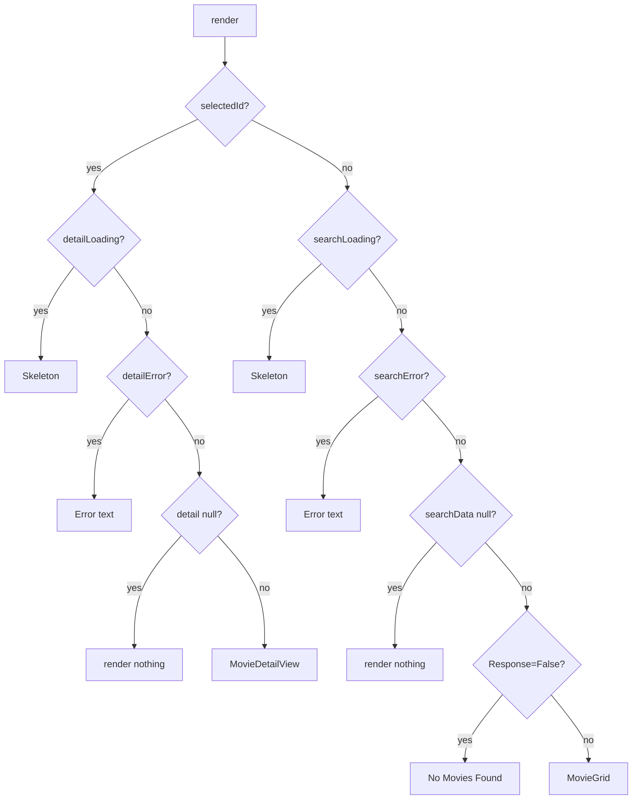

# Movie Detail — Data & State Flow

A walkthrough of how the Movie Search Dashboard flows from a keystroke in the
search bar, to a grid of cards, to a detail view — starting at `App.tsx`.

---

## 1. Component tree at a glance

```
App
├── SearchBar          (controlled input)
├── Skeleton           (loading placeholder)
└── one of:
    ├── MovieGrid           (list mode)
    │   └── MovieCard  ×N
    └── MovieDetailView     (detail mode)
```



---

## 2. State owned by `App`

`App.tsx` owns the two pieces of state that drive the whole UI:

```tsx
const [searchTerm, setSearchTerm]   = useState("");        // what the user types
const [selectedId, setSelectedId]   = useState<string | null>(null); // which card was clicked
```

Everything else (`debouncedTerm`, `url`, `detailUrl`, `searchData`, `detail`)
is **derived** from these two on every render.

| State | Owner | Set by | Used to |
|---|---|---|---|
| `searchTerm` | `App` | `SearchBar` via `onChange` | Debounce → build search URL |
| `selectedId` | `App` | `MovieCard` click via `onSelect` | Build detail URL + choose which view to show |

---

## 3. Data flow: props down, events up

Two independent chains of props start from `App`.

### Search chain

```
App ── value, onChange ──► SearchBar
```

`SearchBar` is a **controlled input** — it never stores the text itself, it
just calls `onChange(newValue)` and reads `value` from props.

### Selection chain

```
App ── movies, onSelect ──► MovieGrid ── movie, onSelect ──► MovieCard
                                                                │
                                             onClick → onSelect(movie.imdbID)
                                                                │
                                                                ▼
                                                          setSelectedId(id) in App
```

`MovieGrid` is a **pass-through** — it forwards `onSelect` to each `MovieCard`
without using it itself. This is *prop drilling*, and it's fine at this depth.

### Back-out chain

```
App ── onBack ──► MovieDetailView
                       │
                onClick → onBack()
                       │
                       ▼
                setSelectedId(null) in App
```



---

## 4. The two `useFetch` calls

`App` uses `useFetch` twice — one for the search results, one for the detail:

```tsx
const url       = debouncedTerm ? `.../s=${...}` : "";
const { data: searchData, loading: searchLoading, error: searchError } =
    useFetch<SearchResponse>(url);

const detailUrl = selectedId    ? `.../i=${selectedId}` : "";
const { data: detail, loading: detailLoading, error: detailError } =
    useFetch<MovieDetail>(detailUrl);
```

### When does each fire?

Inside `useFetch`, the effect depends on `url`:

```tsx
useEffect(() => {
    if (!url) return;         // ← empty string = skip
    // ...fetch...
}, [url, reloadKey]);
```

So a network call happens **only when the URL string changes to a non-empty
value**.

| Trigger | Effect on `searchData` | Effect on `detail` |
|---|---|---|
| User types → `searchTerm` changes | (no fetch yet, waiting on debounce) | — |
| Debounce settles → `debouncedTerm` changes | `url` changes → fetch fires | — |
| Card clicked → `selectedId` set | — | `detailUrl` changes → fetch fires |
| Back clicked → `selectedId = null` | — | `detailUrl = ""` → effect bails out |



---

## 5. `renderResults()` — which view wins?

```tsx
function renderResults() {
    if (selectedId) {                                       // DETAIL MODE
        if (detailLoading) return <Skeleton />;
        if (detailError)   return <p>Error: {detailError}</p>;
        if (!detail)       return null;
        return <MovieDetailView movie={detail} onBack={() => setSelectedId(null)} />;
    }
                                                            // LIST MODE
    if (searchLoading) return <Skeleton />;
    if (searchError)   return <p>Error: {searchError}</p>;
    if (!searchData)   return null;
    if (searchData.Response === 'False') return <p>No Movies Found</p>;
    return <MovieGrid movies={searchData.Search} onSelect={setSelectedId} />;
}
```



**The order matters.** `selectedId` is checked first, so the moment a card is
clicked the UI switches to detail mode — even while `detail` is still loading
(that's why you see the skeleton, not the old grid, during the fetch).

---

## 6. The click round-trip (concrete example)

Say the user clicked the "Batman Begins" card with `imdbID = "tt0372784"`.

1. `MovieCard` runs `onSelect("tt0372784")`.
2. That reference is really `setSelectedId` — React schedules a re-render.
3. `App` re-renders. On this render:
   - `selectedId === "tt0372784"` → `detailUrl` becomes the OMDB detail URL.
   - `renderResults()` enters the detail branch.
4. `useFetch(detailUrl)` sees a new URL, its `useEffect` runs, `loading = true`.
5. First paint of this render: `detailLoading === true` → `<Skeleton />`.
6. Fetch resolves → `setData(json)` inside `useFetch` → another re-render.
7. Now `detail` is populated → `<MovieDetailView movie={detail} onBack={...} />`.
8. User clicks Back → `onBack()` → `setSelectedId(null)` → we fall back to
   the list branch, and `searchData` is still there from before.

---

## 7. Why `<button>` in `MovieCard`?

`MovieCard` wraps its content in a `<button>`:

```tsx
<button onClick={() => onSelect(movie.imdbID)} className="movie-card">
```

That's the correct semantic choice for an in-page, JS-driven action:

| Concern | `<button>` | `<div onClick>` |
|---|---|---|
| Keyboard focusable | ✅ automatic | ❌ needs `tabIndex={0}` |
| Enter / Space activates | ✅ automatic | ❌ needs `onKeyDown` |
| Screen-reader role | ✅ "button" | ❌ nothing |

Two small polish items:

- Add `type="button"` so it never submits a form if you later nest it in one.
- Reset the browser's default button styling in CSS
  (`all: unset; cursor: pointer;` on `.movie-card`, plus a `:focus-visible`
  outline for keyboard users).

Use `<a href>` instead only if the detail view gets its own URL via a router.
Since selection lives in local state here, `<button>` is right.

---

## 8. The "lifting state up" pattern

The whole app is a textbook example of *lifting state up*:

- **State** and **setter** live in the closest common parent (`App`).
- Children receive the value via props, and a **callback** to request changes.
- Data flows **down**, events flow **up**.

> The child never sets parent state directly. It calls a function the parent
> gave it. The parent decides what to do with the value.

`MovieGrid` doesn't need `selectedId` itself, so `App` doesn't pass it — only
the setter (as `onSelect`) travels down. Keeping props minimal like this is
good practice; it makes each component easier to reason about and reuse.
